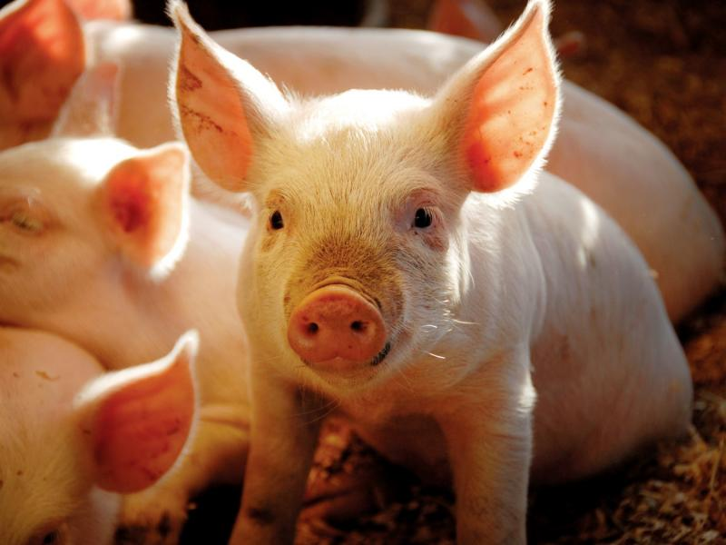
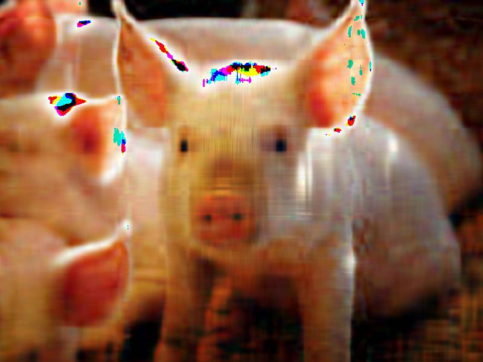

```{r setup, include=FALSE}
knitr::opts_chunk$set(echo = TRUE)
library(ISLR)
library(factoextra)
library(gridExtra)
library(corrplot)
library(RColorBrewer) 
library(gplots)
library(jpeg)
library(tidyverse)
```
# Cluster analysis
**We perform hierarchical clustering on the states using the USArrests data in the ISLR package. For each of the 50 states in the United States, the data set contains the number of arrests per 100,000 residents for each of three crimes: Assault, Murder, and Rape. The data set also contains the percent of the population in each state living in urban areas, UrbanPop. The four variables will be used as features for clustering.**

## (a) Using hierarchical clustering with complete linkage and Euclidean distance, cluster the states.
```{r}
# load data
data(USArrests)
arr_data = USArrests %>%
  janitor::clean_names()

# fit hierarchical cluster
hc.complete <- hclust(dist(arr_data), method = "complete")
```

## (b) Cut the dendrogram at a height that results in three distinct clusters. Which states belong to which clusters?
```{r}
# visualize dendrogram in 3 distinct clusters
fviz_dend(hc.complete, k = 3,        
          cex = 0.3, 
          palette = "jco", 
          color_labels_by_k = TRUE,
          rect = TRUE, rect_fill = TRUE, rect_border = "jco",
          labels_track_height = 2.5)

# show the states in clusters
ind3.complete <- cutree(hc.complete, 3)
# name of states in cluster 1
arr_data[ind3.complete == 1,] %>% row.names()
# name of states in cluster 2
arr_data[ind3.complete == 2,] %>% row.names()
# name of states in cluster 3
arr_data[ind3.complete == 3,] %>% row.names()
```

## (c) Hierarchically cluster the states using complete linkage and Euclidean distance, after scaling the variables to have standard deviation one.
```{r}
# fit hierarchical cluster with standardized variables
hc.complete_std <- hclust(dist(scale(arr_data)), method = "complete")

# visualize dendrogram
fviz_dend(hc.complete_std, k = 3,        
          cex = 0.3, 
          palette = "jco", 
          color_labels_by_k = TRUE,
          rect = TRUE, rect_fill = TRUE, rect_border = "jco",
          labels_track_height = 2.5)

# show the states in clusters
ind3.complete_std <- cutree(hc.complete_std, 3)
# name of states in cluster 1
arr_data[ind3.complete_std == 1,] %>% row.names()
# name of states in cluster 2
arr_data[ind3.complete_std == 2,] %>% row.names()
# name of states in cluster 3
arr_data[ind3.complete_std == 3,] %>% row.names()

```

## (d) What effect does scaling the variables have on the hierarchical clustering obtained? In your opinion, should the variables be scaled before the inter-observation dissimilarities are computed?

Scaling the variables generates different hierarchical results and more states fall into the 1st cluster. I belive we should scale the variables before the inter-observation dissimilarities are computed, for the reason that the magnitudes and units for some variables in the orignial arrest data is different(e.g. murder and urban_pop), and scaling the variables could generate variables with same unit to ensure the variables are clustered under the same measurements.


# PCA
**PCA can be used for image compression. In this question, we use the jpeg package to read and write the .jpeg files. We use a image of cat for illustration, and the sample codes
are given in "image.R". Read the image using img <- readJPEG(`example.jpg'). The image will be represented as three matrices as an array with each matrix corresponding to the RGB color value scheme and each element in a matrix corresponding to one pixel. Extract the individual color value matrices to perform PCA on each of them. Reconstruct the original image using the projections of the data with the first 20 PCs. Now use your own .jpg image to perform image compression via PCA with different numbers of PCs (e.g., 50, 100, 200, ...).**

```{r}
# load orignial image
img = readJPEG('data/pig.jpg')
dim(img)

# extract individual color value matrices
r <- img[,,1]
g <- img[,,2]
b <- img[,,3]
# perform PCA on each of the individual color matrix
img.r.pca <- prcomp(r, center = FALSE)
img.g.pca <- prcomp(g, center = FALSE)
img.b.pca <- prcomp(b, center = FALSE)

rgb.pca <- list(img.r.pca, img.g.pca, img.b.pca)

# Approximate X with XV_kV_k^T
compress <- function(pr, k)
{
  compressed.img <- pr$x[,1:k] %*% t(pr$rotation[,1:k])
  compressed.img
}

# Using first 20 PCs
pca20 <- sapply(rgb.pca, compress, k = 20, simplify = "array")
writeJPEG(pca20, "pca20.jpeg")


# Using 100 PCs
pca100 <- sapply(rgb.pca, compress, k = 100, simplify = "array")
writeJPEG(pca100, "pca100.jpeg")


# Using 500 PCs
pca500 <- sapply(rgb.pca, compress, k = 500, simplify = "array")
writeJPEG(pca500, "pca500.jpeg")
knitr::include_graphics("pca500.jpeg")
```
The image becomes more clear with increasing number of PCs.
